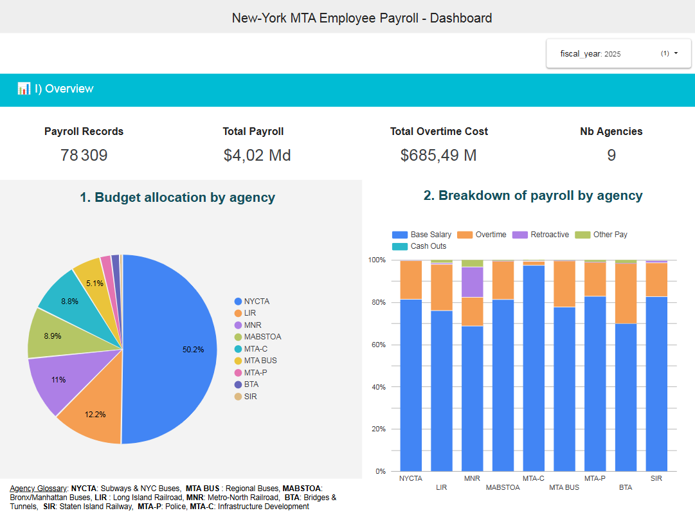
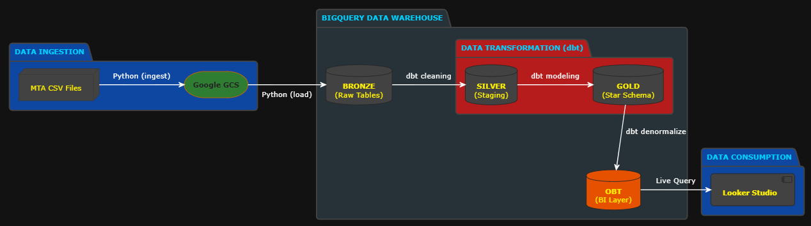

# 🗽 MTA Payroll & Workforce Analytics (2025)

## 📌 Project Overview

This Data Engineering project transforms raw, fragmented Open Data from the New York State into a strategic Decision Support System. By processing over **$4.02 Billion in payroll records**, the pipeline identifies critical operational risks, such as the correlation between specialized staff shortages and the **$685M+ Overtime (OT) expenditure**.

## 📊 Dataset Technical Specifications

- Data Source: New York State Open Data - Data.gov.

- Volume: 78,309 records (~11.8 MB raw CSV).

- Temporal Scope: Comprehensive payroll data for the fiscal year 2025.

- Data Integrity: Automated PII protection via Salted Hashing (SHA-256) during the ingestion phase with Python/Pandas.

## 🏗 Architecture & Tech Stack

- **Ingestion (Python/Docker)**: Automated extraction from New York Open Data with schema enforcement.
- **Data Lake (GCS)**: Bronze layer storing raw CSV files for lineage and replayability.
- **Warehouse (BigQuery)**: Serverless compute for large-scale analytical queries.
- **Transformation (dbt)**:
  - **Incremental Modeling**: Optimized processing using `is_incremental()` to reduce costs.
  - **Deduplication**: Implementing `row_number()` window functions to ensure "Golden Records" for each employee.
  - **Idempotency**: Using deterministic hashing (`farm_fingerprint`) for surrogate keys and PII anonymization.
- **BI & Viz (Looker Studio)**: Interactive dashboarding for deep-dive analysis.
- **Orchestration (Makefile/Docker)**: The entire pipeline is containerized to ensure that the code runs the same way locally as it does on a Compute Engine or Cloud Run instance.

## 🔐 Data Governance & Security

PII Anonymization: Employee names are hashed using a deterministic Salt (farm_fingerprint) to ensure privacy while maintaining joinability between datasets.

Medallion Architecture: Data is organized into Bronze (Raw), Silver (Standardized), and Gold (Star Schema) layers.

## 📈 Business Insights & Case Study

This pipeline goes beyond reporting by highlighting the "Conductor Paradox":

- High Turnover: In 2025, the LIR recruited 34 Assistant Conductors but lost 30 senior Conductors.

- Financial Impact: This near-zero net gain fails to mitigate the $17.5M+ OT bill for these specific roles.

- Technical Impasse: Maintenance roles like Gang Foreman ME saw 16 departures and 0 hires, forcing a structural reliance on massive overtime.

## 📁 Documentation & Resources

To bridge the gap between technical engineering and business strategy, additional resources are available in the documentation/ folder:

### 📊 Analytical Reports

- **Dashboard Notes (MD)**: Detailed technical notes on KPI definitions.

- **Dashboard PDF**: A static export of the Looker Studio dashboard for offline review :

_Click the image below to view the full PDF report._

<a href="documentation/dashboard/MTA-PAYROLL-NYC.pdf">
  
</a>

### 🏗️ Architecture & Data Models

Deep dive into the data engineering foundations of the project:

- **Architecture Notes (MD)**: Comprehensive documentation on the technical implementation.

- **Data Flow Diagram**: Visual mapping of the Python -> GCS -> BigQuery -> dbt pipeline.



- Entity Relationship Diagrams (ERD):
  - **Conceptual Model**

  - **Logical Model**

  - **Physical Model**

- **dbt Materialization Strategy**: Visual guide to the incremental and table materialization logic.

- **Bus Matrix**: Mapping of business processes to dimensional attributes.

## 🛠 Automation with Makefile and Docker : Getting Started (Reproducibility)

The entire lifecycle is orchestrated via a `Makefile` to ensure reproducibility across environments.

### 1. Prerequisites

Before running the pipeline, ensure you have the following installed:

- **Google Cloud SDK**: To authenticate with BigQuery and GCS.
- **Docker**: To run the containerized ETL and dbt environment.
- **GNU Make**: To orchestrate the pipeline commands.

#### 📥 How to install Make:

- **Windows**: Install via [Choco](https://chocolatey.org/) (`choco install make`) or [Scoop](https://scoop.sh/) (`scoop install make`).
- **MacOS**: Already included with Xcode Command Line Tools (`xcode-select --install`) or via [Homebrew](https://brew.sh/) (`brew install make`).
- **Linux**: Usually pre-installed. If not, use `sudo apt install build-essential` (Ubuntu/Debian) or `sudo dnf install make` (Fedora).

### 2. Setup & Authentication

```bash
# Authenticate with Google Cloud
gcloud auth application-default login

cp config.yaml.example config.yaml
cp dbt_mta_payroll/profiles.yml.example dbt_mta_payroll/profiles.yml
cp scripts/schemas/mta_payroll_schema.json.example scripts/schemas/mta_payroll_schema.json

# Run full pipeline (Build -> Test -> Ingest -> Transform)
make all
```

## 🚀 Roadmap & Future Evolutions

### 🏗️ Pipeline & Orchestration

- Orchestration Upgrade: Transition from Makefile to a Python-native orchestrator like Airflow or Dagster to manage complex task dependencies and retries.

- Advanced Observability: Integrate tools like Elementary or Monte Carlo to monitor pipeline health and schema changes in real-time.

- CI/CD Integration: Implement GitHub Actions to automate python tests, dbt test and dbt run on every Pull Request to ensure production stability.

### 💎 Data Quality & Governance

- Multi-Source Validation: Integrate New York City Budget data to perform cross-source reconciliation and validate the accuracy of payroll disbursements.

- Enhanced Missing Data Handling: Refine the name_hash logic to distinguish between "Confirmed Unknown" and "Missing at Source" for better analytical precision.

- Data Contract Implementation: Define YAML-based data contracts to ensure that upstream source changes don't break downstream BigQuery models.

### 📈 Analytical Enrichment

- New Dimensions: Enrich the Star Schema with a dim_weather (rain, snow, storm etc) and dim_geography (Agencies' physical locations) to analyze spatial-temporal overtime trends.

- FinOps Dashboarding: Add a tracking layer in BigQuery to monitor query costs and optimize partitioning/clustering strategies for better cost-efficiency.
