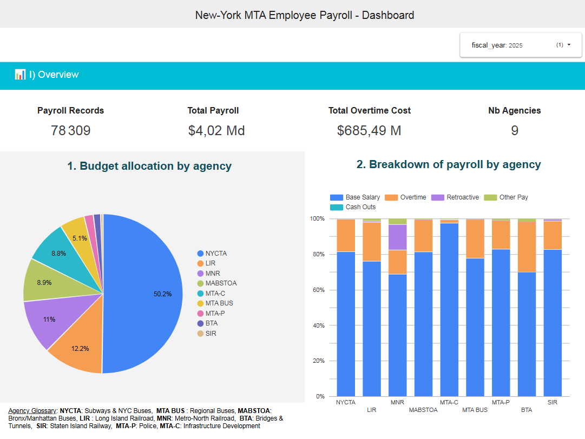
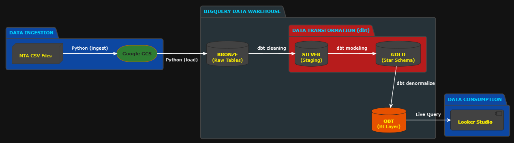
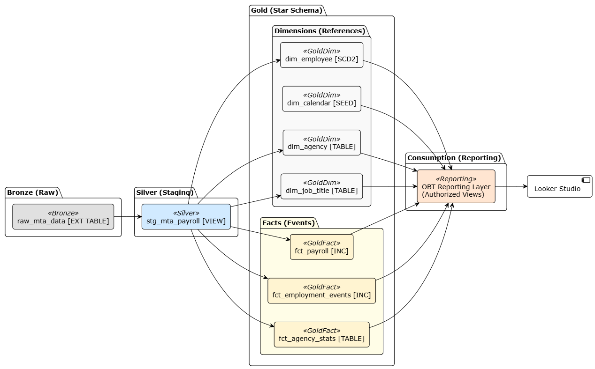

# 🗽 MTA Payroll & Workforce Analytics (2025)

## 📌 Project Overview

This Data Engineering project transforms raw, fragmented Open Data from the New York State into a strategic Decision Support System. By processing over **$4.02 Billion in payroll records**, the pipeline identifies critical operational risks, such as the correlation between specialized staff shortages and the **$685M+ Overtime expenditure**.

## 📊 Dataset Technical Specifications

- Data Source: New York State Open Data - Data.gov.

- Volume: 78,309 records (~11.8 MB raw CSV).

- Temporal Scope: Comprehensive payroll data for the fiscal year 2025.

- Data Integrity: Automated PII protection via SHA-256 hashing during the ingestion phase with Python/Pandas.

## 🏗 Architecture & Tech Stack

- **Ingestion (Python/Docker)**: Automated extraction from New York Open Data with schema enforcement.
- **Data Lake (GCS)**: Bronze layer storing raw CSV files for lineage and replayability.
- **Warehouse (BigQuery)**: Serverless compute for large-scale analytical queries.
- **Transformation (dbt)**:
  - **Incremental Modeling**: Optimized processing using `is_incremental()` to reduce costs.
  - **Deduplication**: Implementing `row_number()` window functions to ensure "Golden Records" for each employee.
  - **Idempotency**: Using deterministic hashing (`farm_fingerprint`) for surrogate keys and PII anonymization.
- **BI & Viz (Looker Studio)**: Interactive dashboarding for deep-dive analysis.
- **Orchestration (Makefile/Docker)**: The entire pipeline is containerized to ensure that the code runs the same way locally as it does on a Compute Engine or Cloud Run instance.

## 🔐 Data Governance & Security

- **Security-First Design**: Implemented SHA-256 hashing on PII and eliminated hardcoded keys via Google ADC to ensure production-grade data privacy. The source dataset is New York State Open Data (already public, real names included), so hashing here protects against casual re-identification in the downstream dashboard rather than a determined adversary — no secret salt is used or needed.

- **Regulatory Alignment**: Built with GDPR-compliant logic, focusing on data minimization and strict storage limitation for sensitive payroll fields.

- **Scalable Architecture**: Leveraged a Medallion Architecture (Bronze/Silver/Gold) to transform raw, messy records into a clean, analytics-ready Star Schema.

## 📈 Business Insights & Case Study

- Operational deficit: Critical roles like BTO and Gang Foreman face a severe "hemorrhage" (50+ departures vs. 0 hires), creating dangerous staffing gaps.

- Overtime Trap: This lack of recruitment forces a structural reliance on overtime, which now accounts for nearly 30% to 50% of total pay for frontline staff.

- Restructuring Lag: The deficit is worsened by the "Lift & Shift" transfers to MTA Headquarters and Civil Service delays, shifting costs from salaries to emergency overtime.

[(Read the Full Business Case Study here)](documentation/dashboard/2_business-insights.md)

## 📁 Documentation & Resources

To bridge the gap between technical engineering and business strategy, additional resources are available in the documentation/ folder:

### 📊 Analytical Reports

- **Dashboard Notes (MD)**: Detailed technical notes on KPI definitions. [(click here)](documentation/dashboard/1_dashboard-notes.md)

- **Business Insights (MD)**: This section provides a deep-dive "Data Story" into the MTA’s current staffing crisis, correlating dashboard trends with official state audits. [(click here)](documentation/dashboard/2_business-insights.md)

- **Dashboard PDF**: A static export of the Looker Studio dashboard for offline review :

_Click the image below to view the full PDF report._

<a href="documentation/dashboard/MTA-PAYROLL-NYC.pdf">
  
</a>

### 🏗️ Architecture & Data Models

Deep dive into the data engineering foundations of the project:

- **Architecture Notes (MD)**: Comprehensive documentation on the technical implementation.

- **Data Flow Diagram**: Visual mapping of the Python -> GCS -> BigQuery -> dbt pipeline.



- Entity Relationship Diagrams (ERD):
  - **Conceptual Model**

  - **Logical Model**

  - **Physical Model**

- **dbt Materialization Strategy**: Visual guide to the incremental and table materialization logic.

  

- **Bus Matrix**: Mapping of business processes to dimensional attributes.

## ☁️ Production Deployment (GCP)

The pipeline runs unattended in production on Google Cloud, no local machine involved:

- **CI/CD (GitHub Actions)**: keyless authentication to GCP via **Workload Identity Federation** (no service-account JSON keys anywhere). Manually-triggered (`workflow_dispatch`) pipeline: a `terraform` job provisions the Artifact Registry repo, the data-lake bucket, and the orchestration resources, then a `deploy` job builds one Docker image (tagged by commit SHA) and deploys it as **4 separate Cloud Run Jobs** — one per pipeline stage (`create-datasets`, `extract`, `load`, `transform`) — each running under its own **least-privilege service account** (only the BigQuery/Storage roles that specific stage actually needs, not a shared identity).
- **Orchestration (Cloud Workflows + Cloud Scheduler)**: replaces the local `Makefile` chain for production runs. A Workflow calls the 4 Cloud Run Jobs sequentially and relies on GCP's built-in execution-failure propagation (no custom retry/error-branching logic needed); Cloud Scheduler triggers it on a monthly cron.
- **Infrastructure as Code (Terraform)**: two separate state roots — a one-time, manually-applied bootstrap (`setup/`: WIF pool, deploy + runtime service accounts) and a CI-applied application layer (`infra/`: Artifact Registry, data-lake bucket, Workflow, Scheduler). The 4 Cloud Run Jobs themselves are deliberately **not** Terraform-managed (deployed imperatively by CI, matching how BigQuery datasets stay outside Terraform too — see Architecture notes).

## 🛠 Local Development (Makefile and Docker)

The `Makefile` + Docker path is kept for local development and testing — the same containerized code that runs in production.

### 1. Prerequisites

Before running the pipeline, ensure you have the following installed:

- **Google Cloud SDK**: To authenticate with BigQuery and GCS.
- **Docker**: To run the containerized ETL and dbt environment.
- **GNU Make**: To orchestrate the pipeline commands.

#### 📥 How to install Make:

- **Windows**: Install via [Choco](https://chocolatey.org/) (`choco install make`) or [Scoop](https://scoop.sh/) (`scoop install make`).
- **MacOS**: Already included with Xcode Command Line Tools (`xcode-select --install`) or via [Homebrew](https://brew.sh/) (`brew install make`).
- **Linux**: Usually pre-installed. If not, use `sudo apt install build-essential` (Ubuntu/Debian) or `sudo dnf install make` (Fedora).

### 2. Setup & Authentication

```bash
# Authenticate with Google Cloud
gcloud auth application-default login

make all   # Build -> Test -> Ingest -> Transform
```

`config.yaml`, `dbt_mta_payroll/profiles.yml`, and `scripts/schemas/mta_payroll_schema.json` are committed with real (non-secret) values for this deployment — nothing to copy from `.example` for local dev against the same GCP project. To reproduce this project under your **own** GCP project instead (a fresh `project_id`/bucket name — GCS bucket names are globally unique), start from the `.example` files:
```bash
cp config.yaml.example config.yaml
cp dbt_mta_payroll/profiles.yml.example dbt_mta_payroll/profiles.yml
cp scripts/schemas/mta_payroll_schema.json.example scripts/schemas/mta_payroll_schema.json
```

## 🚀 Roadmap & Future Evolutions

### 🏗️ Pipeline & Orchestration

- Advanced Observability: Integrate tools like Elementary or Monte Carlo to monitor pipeline health and schema changes in real-time.

- Automated CI Testing: Run `pytest`/`dbt test` on every Pull Request (currently manual — the deploy pipeline itself is CI/CD, but PR-time checks aren't wired up yet).

### 💎 Data Quality & Governance

- Multi-Source Validation: Integrate New York City Budget data to perform cross-source reconciliation and validate the accuracy of payroll disbursements.

- Enhanced Missing Data Handling: Refine the name_hash logic to distinguish between "Confirmed Unknown" and "Missing at Source" for better analytical precision.

- Data Contract Implementation: Define YAML-based data contracts to ensure that upstream source changes don't break downstream BigQuery models.

### 📈 Analytical Enrichment

- New Dimensions: Enrich the Star Schema with a dim_weather (rain, snow, storm etc) and dim_geography (Agencies' physical locations) to analyze spatial-temporal overtime trends.

- FinOps Dashboarding: Add a tracking layer in BigQuery to monitor query costs and optimize partitioning/clustering strategies for better cost-efficiency.
