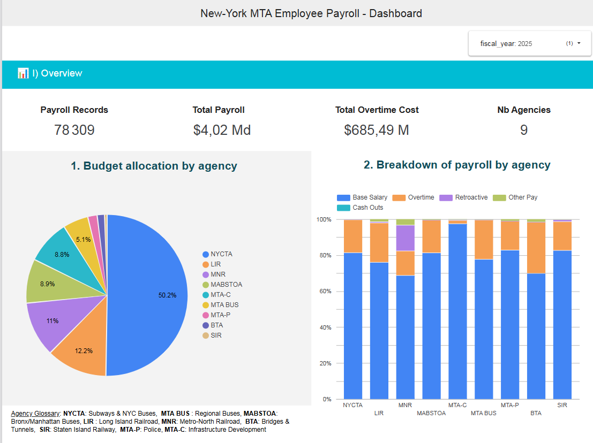
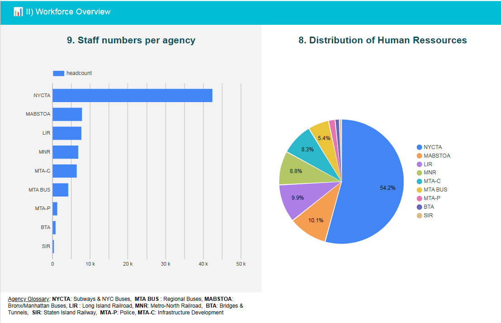
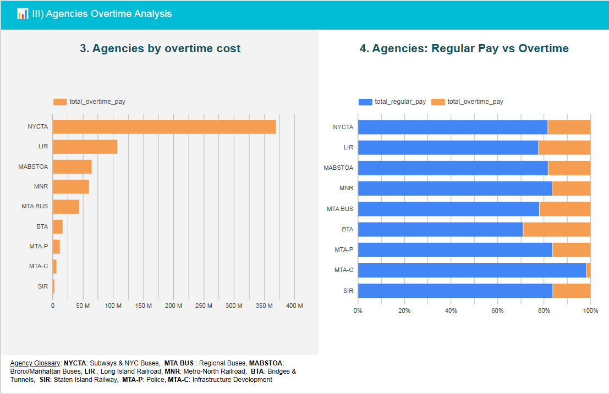
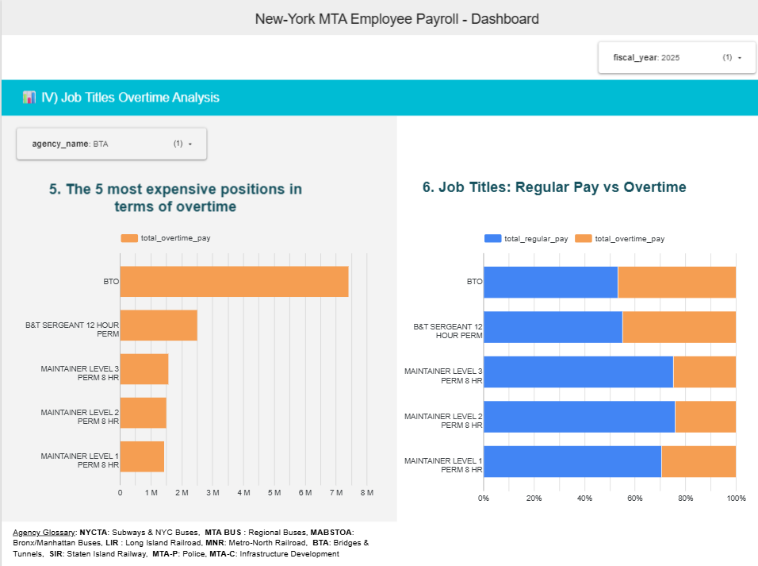
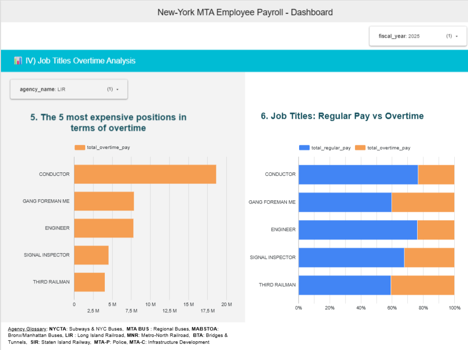
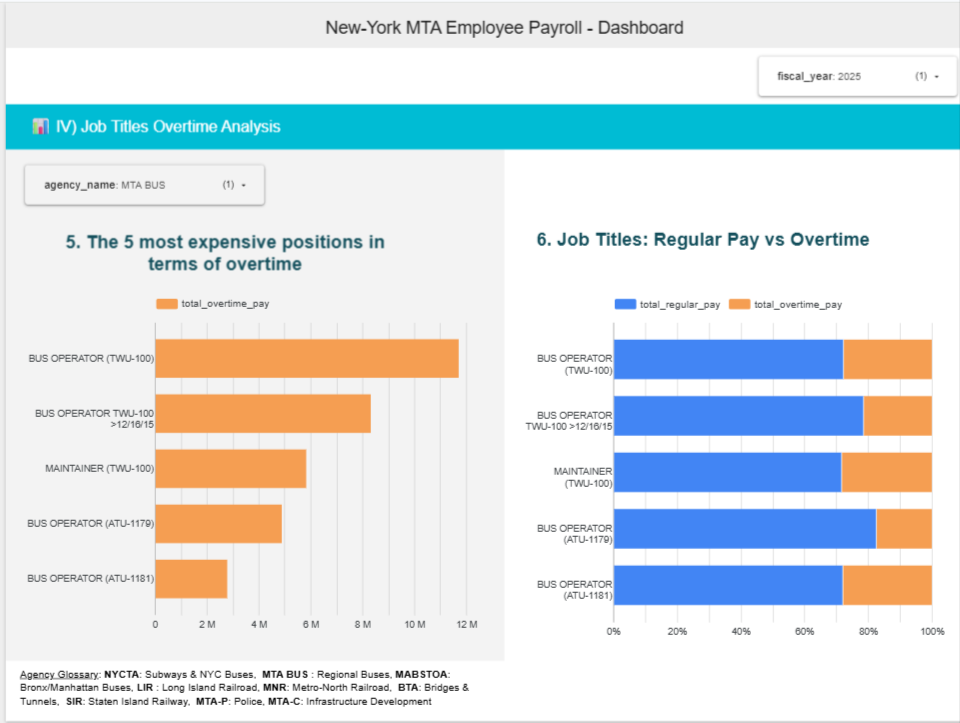
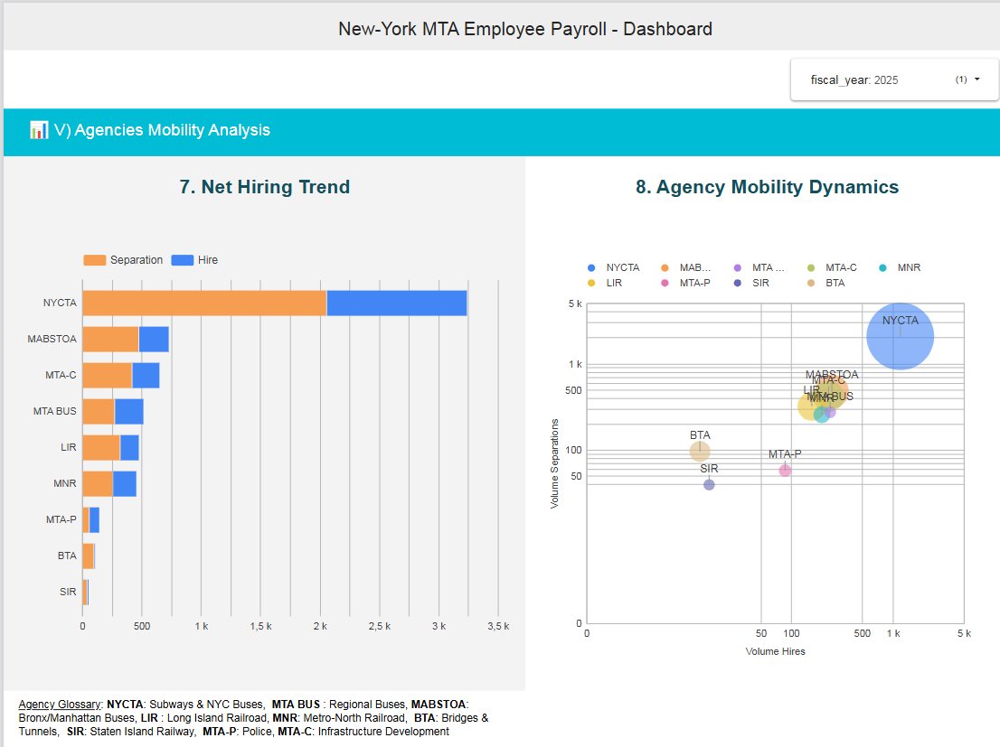
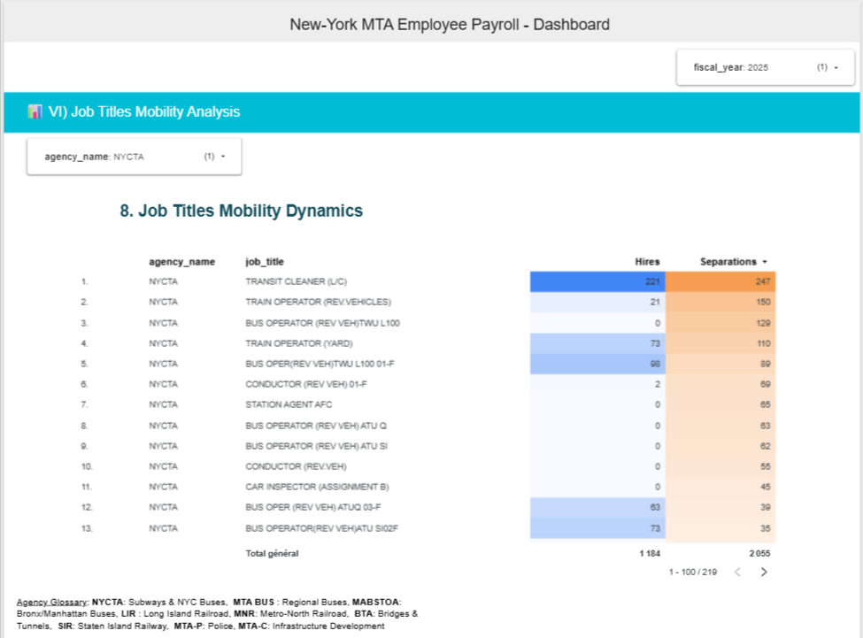
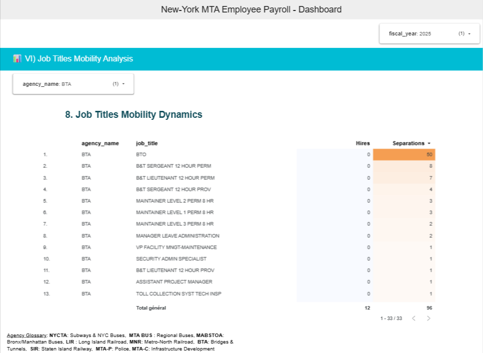
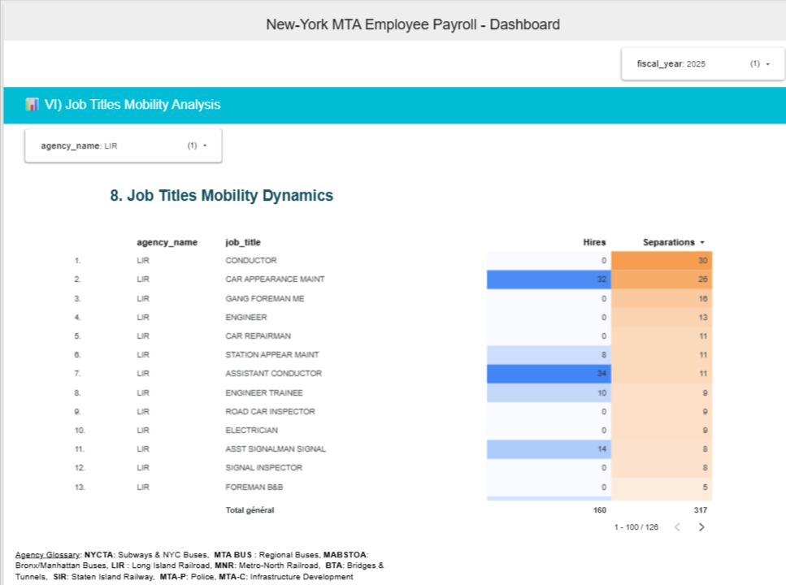

# 📊 Business Insights - MTA Payroll Analysis (2025)

### 1. Budget Overview

- **Payroll**: The MTA managed a total budget of **$4.02 billion** for 78,309 employees.
- **Impact of Overtime**: Overtime represents a major cost of **$685.49 million**, or approximately 17% of total payroll.

### 2. Workforce Overview

The four largest agencies by headcount **—NYCTA, MABSTOA, LIR, and MNR—** represent the backbone of NYC’s transit infrastructure **(Subway, Bus, and Rail)**. Their workforce volume shows a direct linear correlation with total payroll expenditures.

### 3. Agencies Overtime

A critical threshold is crossed by **BTA, LIRR, and MTA BUS**, where overtime expenditures **exceed 20% of total labor costs**. Most notably the **BTA stands out with an overtime ratio nearing 30%**, signaling a severe reliance on additional hours to maintain basic operational levels.

### 4. Breakdown : Job Overtime by Agencies

#### 1. BTA

- A critical level of 'operational overheating' is observed for **BTO (Bridge and Tunnel Officers) and B&T Sergeant** (12-hour permanent) positions. For these roles, **overtime pay accounts for nearly 50% of total compensation**, indicating a severe structural reliance on extended shifts to maintain basic security and tolling operations.

- When overtime reaches **50% of total pay**, it means these officers are effectively **doubling their legal working hours**.

- Risk of Fatigue: For security positions (Sergeants), this is a major operational risk.

##### Technical Roles Definitions

- **BTO (Bridge and Tunnel Officer)**: These are the field officers responsible for security, traffic management, and assistance on MTA bridges and tunnels.

- **B&T Sergeant (12-hour perm)**: This is the supervisory rank (sergeant) for B&T officers. The designation “12-hour perm” means that their position is based on permanent 12-hour work cycles.

#### 2. LIR

- **Third Railman & Gang Foreman ME**: These two positions are also completely “overheated,” with overtime representing a nearby **40% of their total compensation**.

##### Technical Role Definitions

- **Third Railman**: A specialized electrician responsible for the third rail, which provides high-voltage electric power to the subway trains. This is a high-risk role essential for keeping trains moving. Without them, the entire system loses power.

- **Gang Foreman ME**: (Maintenance Electrical): A frontline supervisor (the "Foreman") who leads a "gang" or crew of electricians. They plan repairs, ensure the safety of workers on the tracks, and sign off on critical maintenance work.

#### 3. MTA BUS

Overtime pay accounts for **nearly 30% of the total compensation for both Bus Operators and Subway Maintainers**. This high ratio suggests that the 24/7 service requirements are currently sustained by existing staff rather than reaching optimal headcounts.

### 5. HR Dynamics and Retention

- **Overall deficit**: The year 2025 ends with a workforce deficit in all agencies, with the exception of the MTA-P.

### 6. Breakdown : Recruitment by Agencies

#### 1. NYCTA

**Bus Operators and Train Conductors are not being replaced** at the rate of their departures. This staffing vacuum creates a direct 'substitution effect'—where the 24/7 service obligations are met by paying existing staff at premium overtime rates rather than onboarding new full-time employees.

#### 2. BTA

- **The Bridge and Tunnel Officer (BTO)** position is experiencing a true hemorrhage: 50 separations against 0 hires in the current period.

- **B&T Sergeant (12 Hour Perm)**: 8 departures, 0 hires.

- **B&T Lieutenant (12 Hour Perm)**: 7 departures, 0 hires.

- This specific 'Hemorrhage' explains why the remaining BTOs and Sergeants are reaching nearly 50% of their compensation in overtime. They aren't just working extra hours; they are literally covering for a missing army of colleagues.

#### 3. LIR

- The **Gang Foreman ME** position recorded **16 departures** and **0 new hires**.

- The **Third Railman** recorded **3 departures** and **0 new hires**.

- **The “hot” consequence**: The fewer technicians there are, the more overtime those who remain have to work to keep the rails running. This excessive workload is likely to further increase turnover (burnout), exacerbating the crisis.

#### Conclusion:

The MTA is struggling to break the overtime cycle. Its recruitment barely covers turnover for operational roles and fails entirely to address the deficit in specialized technical staff.

### 5. External Audit Correlation: Strategic & Structural Insights

The observed net deficit in MTA technical roles is likely driven by a combination of two major factors identified in official oversight documentation:

- **Civil Service Hiring Delays**: Administrative bottlenecks in the examination process for "Operating" roles (such as Conductors and Technicians) prevent the agency from replacing departures at the required pace.

[Reference: Report 2022-F-27: Employee Qualifications, Hiring, and Promotions](https://www.osc.ny.gov/state-agencies/audits/2022/09/26/employee-qualifications-hiring-and-promotions-follow)

- **'Lift & Shift' Organizational Transfers**: As part of the MTA Transformation Plan, many support and technical functions were consolidated from individual agencies (like NYCTA) to the centralized MTA Headquarters. These movements appear as "separations" in agency-specific data without necessarily being resignations.

[Reference: Report 2022-S-5: Transformation of the MTA](https://www.osc.ny.gov/state-agencies/audits/2025/08/08/transformation-mta)

Note: This trend is a strategic hypothesis to be further corroborated by analyzing MTA Headquarters payroll datasets to track the inflow of these transferred positions.
